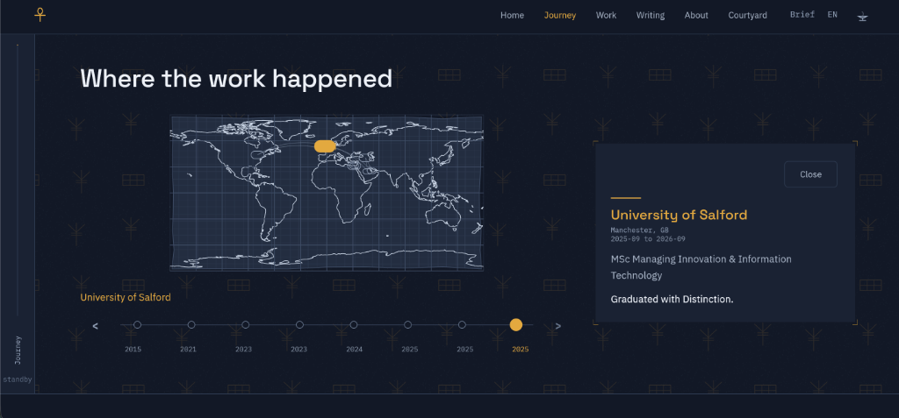
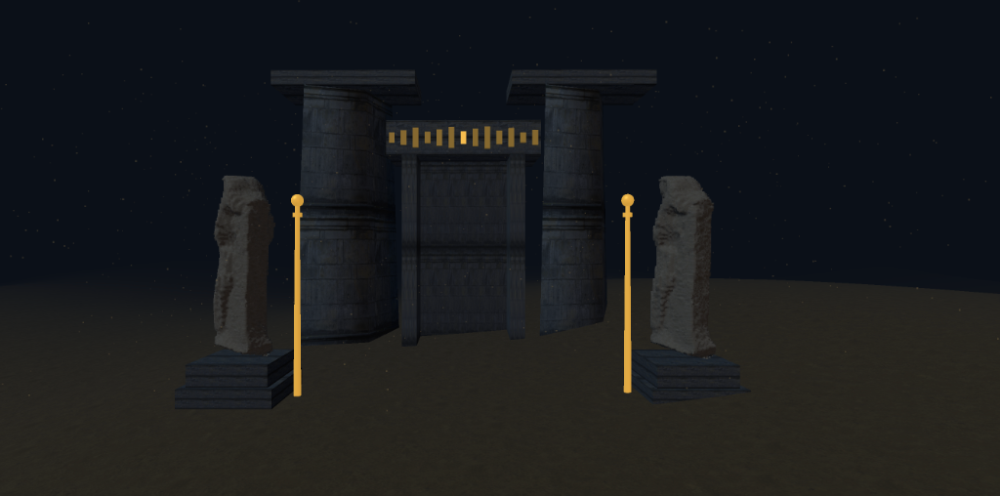

# Ahmed Elsherbini

[sherbini.uk](https://sherbini.uk/)

## What I built

### Portfolio

A personal portfolio website.

**Stack:** Flutter · Dart · WebAssembly · GitHub Pages



### Intro

A 3D Egyptian temple scene that greets visitors before the portfolio loads.

**Stack:** Three.js · GLSL · JavaScript



### Admin Panel

A content management dashboard for publishing and editing portfolio data.

**Stack:** Cloudflare Workers · JavaScript · KV Storage

## Run

```bash
flutter pub get
flutter gen-l10n
dart run build_runner build --delete-conflicting-outputs
dart run tool/generate_mark.dart
dart run tool/generate_static.dart
flutter run -d chrome --wasm
```

## Credits

The guardian statue in the intro is an adaptation of *Statue of Ra-Horakhty, 3D
photogrammetry scan (STL)* by
[OmarElAtabany](https://commons.wikimedia.org/wiki/User:OmarElAtabany), from
[Wikimedia Commons](https://commons.wikimedia.org/wiki/File:Statue_of_Ra-Horakhty,_3D_photogrammetry_scan_(STL).stl),
used under [CC BY-SA 4.0](https://creativecommons.org/licenses/by-sa/4.0/). The
adapted mesh carries the same licence; what was changed, and why, is recorded in
[`web/intro/models/LICENSE.md`](web/intro/models/LICENSE.md).

Everything else — the type, the ornament, the signs, the sounds and the code —
is original to this repository and is MIT licensed.
